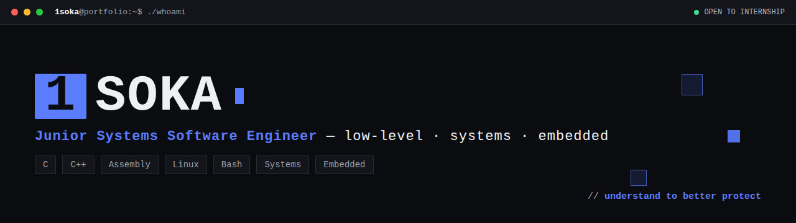

<div align="center">



# `1soka` — Portfolio 🔵🖥️

**Junior Systems Software Engineer** · low-level · systems · embedded
*understand to better protect* 🛡️


</div>

---

## 🌐 Live

> **https://1soka.github.io** — _update this once deployed_ 🔧

## 🧠 About

A fast, **fully-static** personal portfolio built from scratch — no framework, no tracker, no backend. Pixel / terminal design system, dark & light themes, custom cursor, animated project covers and a CPU-pipeline "journey" section. Self-taught developer, currently at **École 42 Angoulême**, heading toward **systems & embedded**. 🚀

## 🧰 Stack

| | |
|---|---|
| 🧠 **Low-level** | C · C++ · Assembly |
| 🐧 **Systems** | Linux · Bash · Shell · Vim / Neovim |
| 🗄️ **Back & data** | Python · PHP · PostgreSQL · Node.js / Express |
| 🛠️ **Tools** | Git · GitHub · Docker · VirtualBox |
| 🔜 **Next** | Embedded C · Wokwi · MATLAB |

## 📁 Structure

```text
.
├── index.html              # the whole site (self-contained, one file)
├── favicon.svg
├── assets/
│   └── banner.png
├── .well-known/
│   └── security.txt        # responsible disclosure (RFC 9116)
└── _headers                # security headers (Netlify / Cloudflare Pages)
```

## 🛡️ Security

Hardened as far as a static page can be:

- 🚫 **Zero third-party JavaScript** (no external scripts loaded)
- 🔒 **CSP** + **Referrer-Policy** via `<meta>`, `rel="noopener noreferrer"` on every external link
- 🧼 **XSS-safe** client-side search + anti self-XSS console notice
- 📄 **`security.txt`** for responsible disclosure
- 🧱 **`_headers`** adds HSTS, X-Frame-Options, X-Content-Type-Options, CSP (on Netlify / Cloudflare)

## 📫 Contact

- ✉️ **1soka.portfolio@gmail.com**
- 💻 **github.com/1soka**

---

<div align="center"><sub>built pixel by pixel — © 2026 <b>1soka</b> · <i>understand to better protect</i> 🔵</sub></div>
